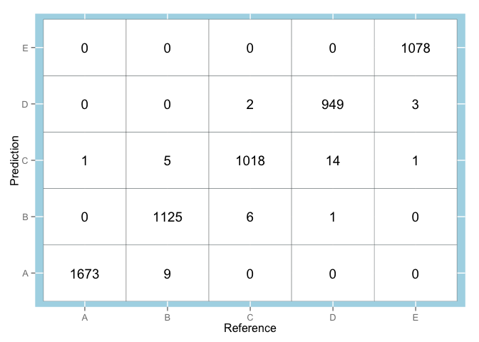

# Predicting Qualitative Activity of Weight Lifting Exercises
by David Solis for Practical Machine Learning (Johns Hopkins University via Coursera) Project Assignment

## Synopsis
Using devices such as Jawbone Up, Nike FuelBand, and Fitbit it is now possible to collect a large amount of data about personal activity relatively inexpensively. These type of devices are part of the quantified self-movement – a group of enthusiasts who take measurements about themselves regularly to improve their health, to find patterns in their behavior, or because they are tech geeks. One thing that people regularly do is quantify how much of a particular activity they do, but they rarely quantify how well they do it. 

The goal of this project was to build and train a machine learning algorithm to recognize the manner in which a particular exercise (lifting a barbell) is performed by a subject based on data collected from accelerometers (on the belt, forearm, arm, and dumbell) attached to the person performing the exercises. The data set consists of data from six different participants and the outcome is classified into five different categories, either correctly or incorrectly - 4 variations of common mistakes. The main objective is to implement a classifier that correctly categorizes 20 samples provided as a testing set.

More information on the data used can be found [here](http://groupware.les.inf.puc-rio.br/har). (see the section on the Weight Lifting Exercise Dataset). 


```r
packages <- c("data.table", "caret", "doMC")
sapply(packages, require, character.only = TRUE, quietly = TRUE)

setwd("~/Documents/practical-machine-learning/assessments/git-repository")
registerDoMC(cores=6)
```

## Data Processing

### Data loading, cleaning and transforming
1. Load data. At same time drop column 1 and columns raw_timestamp_part_1, raw_timestamp_part_2,  cvtd_timestamp, new_window and num_window.
2. Drop user_name column. 
3. Convert columns to numeric


```r
pml.training <- fread("pml-training.csv",stringsAsFactors=TRUE, drop=c(1,3:7))
pml.testing <-  fread("pml-testing.csv",stringsAsFactors=TRUE, drop=c(1,3:7))

pml.training[,user_name:=NULL]
pml.testing[,user_name:=NULL]

pml.training[, classe:=factor(classe)]

cols.number <- dim(pml.training)[2]
for (id in c(2L:(cols.number-1))) set(pml.training, j=id, value=as.numeric(pml.training[[id]]))
for (id in c(2L:(cols.number-1))) set(pml.testing, j=id, value=as.numeric(pml.testing[[id]]))
```

## Feature Selection
1. Many of the columns contain a very large number of NAs values, these columns have been removed.  
2. Change classe to factor
3. Remove columns with high correlation

In summary, many columns have been discarded. The remaining 45 feature variables are used to predict the variable "classe".    


```r
nas <- sapply(2L:(cols.number-1), function(i) {sum(is.na(pml.training[,i, with=FALSE]))})
colnames.to.drop <- colnames(pml.training)[which(nas != 0) + 1]
pml.training[,eval(colnames.to.drop) := NULL]
pml.testing[,eval(colnames.to.drop) := NULL]

classe <- pml.training$classe
pml.training[,classe:=NULL]
pml.testing[,problem_id:=NULL]

high.correlation <- findCorrelation(cor(pml.training), 0.90)
pml.training <- pml.training[, -high.correlation, with=FALSE]
pml.testing <- pml.testing[, -high.correlation, with=FALSE]
```


## Model Building

The training set needs to be large enough to achieve a relatively high accuracy, and the cross validation set also needs to be large enough to give a good indication of the out of sample error.

The training data set was split up into one portion (70%) for model building, model cohort, and another portion (30%) for cross-validation, cross-validation cohort.

Random forest was chosen as the prediction algorithm used. This model was built on the model cohort and then tested on the cross-validation cohort.


```r
inTrain <- createDataPartition(classe, p=.7, list=FALSE)
training <- data.frame(pml.training[inTrain[,1], ], classe=classe[inTrain])
cross.validation <- data.frame(pml.training[-inTrain[,1], ], classe=classe[-inTrain])

set.seed(7513)
model <- train(classe ~., data=training, method="rf", trControl=trainControl(method="cv", verboseIter=TRUE, number=10), ntrees=750)
```

```
## Loading required package: randomForest
## randomForest 4.6-7
## Type rfNews() to see new features/changes/bug fixes.
```

```r
cross.validation.predict <- predict(model, cross.validation)
```


### Confusion Matrix
The confusion matrix allows visualization of the performance of an machine learning algorithm - typically a supervised learning. Each column of the matrix represents the instances in a predicted class, while each row represents the instances in an actual (reference) class.


```r
confusionMatrix <- confusionMatrix(cross.validation.predict, cross.validation$classe)
confusionMatrix$table
```

```
##           Reference
## Prediction    A    B    C    D    E
##          A 1673    9    0    0    0
##          B    0 1125    6    1    0
##          C    1    5 1018   14    1
##          D    0    0    2  949    3
##          E    0    0    0    0 1078
```

```r
cf.table <- as.data.frame(confusionMatrix$table)
ggplot(cf.table, aes(x=Reference, y=Prediction), environment=environment()) +
  geom_tile(fill="white", color="black") +
  geom_text(aes(label=cf.table$Freq)) +
  theme(legend.position="none",  panel.background =element_rect(fill='lightblue') )+
  xlab("Reference") +                    
  ylab("Prediction") 
```

 
**Figure 1. Confusion Matrix**

### Accuracy  
The random forests model has 99.3% out of sample accuracy, or 0.7% out of sample error.


```r
confusionMatrix$overall
```

```
##       Accuracy          Kappa  AccuracyLower  AccuracyUpper   AccuracyNull 
##         0.9929         0.9910         0.9904         0.9949         0.2845 
## AccuracyPValue  McnemarPValue 
##         0.0000            NaN
```

## Prediction
Finally we apply the model to predict the classe on the testing set.

```r
testing.predict <- predict(model, pml.testing)
```

```
## Loading required package: randomForest
## randomForest 4.6-7
## Type rfNews() to see new features/changes/bug fixes.
```

```r
testing.predict
```

```
##  [1] B A B A A E D B A A B C B A E E A B B B
## Levels: A B C D E
```

## Summary
The model used was a random forest algorithm using 750 trees. Accuracy obtained was 99.3% with good calculated concordance (kappa = 0.99). The trained algorithm correctly identified 20 out of 20 test cases (the results were considered 100% accurate in the submission part of the project).

## References
1. Velloso, E.; Bulling, A.; Gellersen, H.; Ugulino, W.; Fuks, H. [Qualitative Activity Recognition of Weight Lifting Exercises](http://groupware.les.inf.puc-rio.br/work.jsf?p1=11201). Proceedings of 4th International Conference in Cooperation with SIGCHI (Augmented Human '13). Stuttgart, Germany: ACM SIGCHI, 2013
2. [Wikipedia article about Confusion Matrix](http://en.wikipedia.org/wiki/Confusion_matrix)
